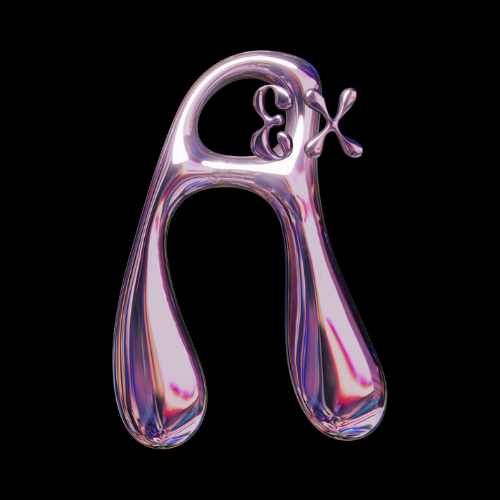

<div style="float: left; margin-right: 20px;">
  
</div>


### [ASTEROID-EX](asteroidex.com)
```
A future where privacy and freedom are not just ideals, but the Norm. that is the future we should accept !
"Educate yourself on the fundamentals of privacy as a human right. Take the first step with me towards a future that knows no shackles and respects your data.
```

### Support me !

<div >
  
</div>

<br>

<br>


> #### Credits 

`The Hacker-Blog theme`

>*Hacker-Blog is a minimalistic, responsive jekyll theme built for hackers. It is based on the [hacker theme](https://github.com/pages-themes/hacker) for project pages.*

>Demo: [https://ashishchaudhary.in/hacker-blog](https://ashishchaudhary.in/hacker-blog)


*Note: All links in the site are prepended with `baseurl`. Default `baseurl` is `/`. Any other baseurl can be setup like `baseurl: /hacker-blog`, which makes the site available at `http://domain.name/hacker-blog`.*

### License

 CC0 1.0 Universal
